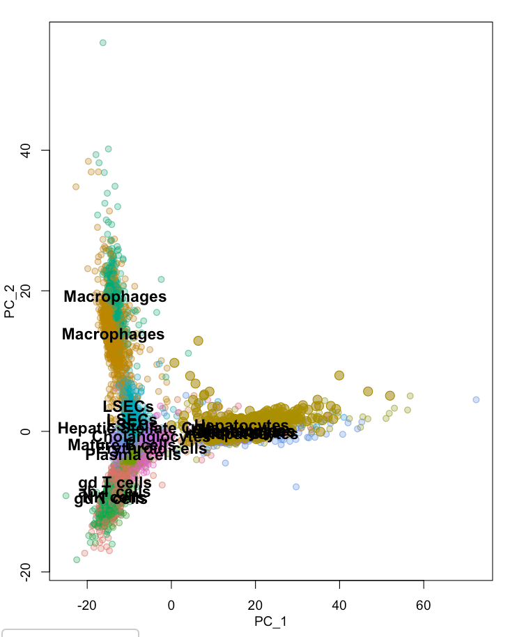
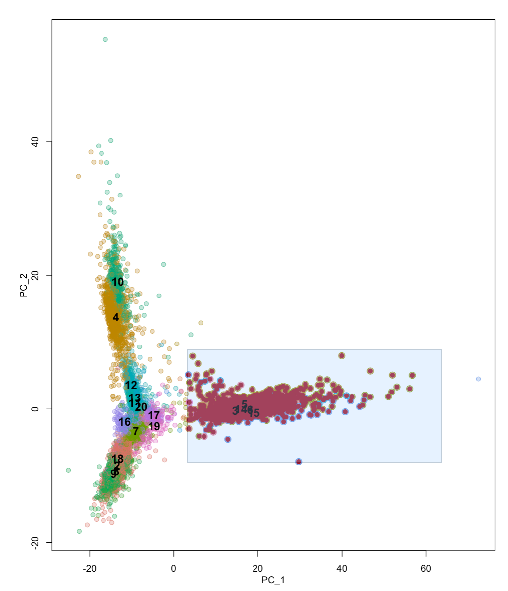

# Applying topic modeling approaches on sc pilot data

Include data from:
     Pilot (iPSC-derived chondrocytes from 3 individuals x 2 treatment conditions; 10x)
     MSC-Pilot (Genevieve Housman's human data of iPSCs and iPSC-derived MSCs from human-chimp study; 10x)
     Hepatocytes (from liver homogenate; 10x)
     Chondrocytes (from OA patients; STRT protocol)
     
# Load Libraries

```{r load libraries}
library(Seurat)
library(tidyverse)
library(CountClust)
library(maptpx)
library(ggplot2)
library(MAST)
library(RColorBrewer)
library(ggfortify)
```

# Load in datasets and merge them

Load in datasets and create Seurat objects for each of them. Add metadata about the cell type they were assigned in their original contexts. Merge the Seurat object into one large object.

```{r Loading in data matrices}

if (file.exists("data/Combined_singlecell_data_first.rds")){
Combined.common <- readRDS("data/Combined_singlecell_data_first.rds")
} else {

#Pilot data
ANT1.2 <- readRDS("data/ANT1_2.rds")
ANT1.2 <- AddMetaData(ANT1.2, "iPSC-Chondrocyte", col.name = "Cell.Type")
dim(ANT1.2)

#Chondrocytes from OA patients (https://www.ncbi.nlm.nih.gov/pubmed/30026257) run through STRT protocol
chondro <- read.table("/project2/gilad/anthonyhung/Projects/OAStrain_project/outside_scData/GSE104782_allcells_UMI_count.txt.gz", header = T)
chondro_genes <- chondro[,1]
chondro_data <- chondro[,-1]
chondro <- chondro_data
rownames(chondro) <- chondro_genes
#load chondro cluster data from paper
chondro_metadata <- read_csv("data/GSE104782_Table_Cell_quality_information_and_clustering_information.csv")
#subset data to include only those that were assigned to a chondrocyte cluster in the paper
chondro.filtered <- chondro[,!is.na(chondro_metadata$Cluster)]
cluster.ident <- paste0("Chondro ", chondro_metadata$Cluster[!is.na(chondro_metadata$Cluster)])
#Create seurat object from chondrocytes
chondro.seurat <- CreateSeuratObject(chondro.filtered, project="Chondrocytes")
chondro.seurat <- AddMetaData(chondro.seurat, cluster.ident, col.name = "Cell.Type")
dim(chondro.seurat)

#iPSCs/MSCs/osteoblasts from Human/chimp panel. Combine all the datasets and subset for humans
ghousman_data_dir <- ("/project2/gilad/ghousman/skeletal-human-chimp/human-chimp-skeletal-scRNA/data/cellranger-data-full/")
gh_ipsc_1.1 <- readRDS(paste0(ghousman_data_dir, "h.c.dat.spp.GHO-1.rds"))
gh_msc_1.1 <- readRDS(paste0(ghousman_data_dir, "h.c.dat.spp.GHO-2.rds"))
gh_ipsc_1.2 <- readRDS(paste0(ghousman_data_dir, "h.c.dat.spp.HOU-10.rds"))
gh_msc_1.2 <- readRDS(paste0(ghousman_data_dir, "h.c.dat.spp.HOU-12.rds"))
gh_ipsc_2.1 <- readRDS(paste0(ghousman_data_dir, "h.c.dat.spp.HOU-1.rds"))
gh_msc_2.1 <- readRDS(paste0(ghousman_data_dir, "h.c.dat.spp.HOU-2.rds"))
gh_ipsc_3.1 <- readRDS(paste0(ghousman_data_dir, "h.c.dat.spp.HOU-9.rds"))
gh_msc_3.1 <- readRDS(paste0(ghousman_data_dir, "h.c.dat.spp.HOU-11.rds"))
gh_big <- merge(gh_ipsc_1.1, y = c(gh_msc_1.1, gh_ipsc_1.2, gh_msc_1.2, gh_ipsc_2.1, gh_msc_2.1, gh_ipsc_3.1, gh_msc_3.1), 
                add.cell.ids = c("ipsc1.1", "msc1.1", "ipsc1.2", "msc1.2", "ipsc2.1", "msc2.1", "ipsc3.1", "msc3.1"), project = "ghousman")
gh_big_humans <- subset(gh_big, species == "Human")
gh_big_humans <- AddMetaData(gh_big_humans, "Ghousman", col.name = "orig.ident")
dim(gh_big_humans)

#Human Liver samples run through 10x (https://doi.org/10.1038/s41467-018-06318-7). This is a subset of the entire dataset, which is from whole liver homogenate. I used scViz to subset the data for clusters that were called hepatocytes in the original study (3490 cells)
liver <- readRDS("data/humanLiverSubset_hepatocytes.rds")
liver <- AddMetaData(liver, "Hepatocyte", col.name = "Cell.Type")
dim(liver)

# Merge Datasets

# Merge the seurat objects into one large one, keeping metadata about which study they originated in as well as their assigned cell type.

# merge based on common genes between ALL datasets
common.features <- Reduce(intersect, list(rownames(ANT1.2), rownames(chondro.seurat), rownames(gh_big_humans), rownames(liver)))
length(x = common.features)
Combined.common <- merge(ANT1.2[common.features, ], y = c(chondro.seurat[common.features, ], gh_big_humans[common.features, ], liver[common.features, ]), project = "Combined.common")

saveRDS(Combined.common, "data/Combined_singlecell_data_first.rds")
}
```




# Analysis of combined dataset in Seurat

Now we can look at the cells in Seurat, including PCA and UMAP

```{r Seurat analysis}
VlnPlot(Combined.common, features = c("nFeature_RNA", "nCount_RNA"), ncol = 2, group.by = "orig.ident")
VlnPlot(Combined.common, features = c("nFeature_RNA", "nCount_RNA"), ncol = 2, group.by = "Cell.Type")

# FeatureScatter is typically used to visualize feature-feature relationships, but can be used
# for anything calculated by the object, i.e. columns in object metadata, PC scores etc.

FeatureScatter(Combined.common, feature1 = "nCount_RNA", feature2 = "nFeature_RNA")

if (file.exists("data/Combined_singlecell_data.rds")){
Combined.common <- readRDS("data/Combined_singlecell_data.rds")
} else {

#Normalize Data
Combined.common <- NormalizeData(Combined.common, normalization.method = "LogNormalize", scale.factor = 10000)

# Feature selection

Combined.common <- FindVariableFeatures(Combined.common, selection.method = "vst", nfeatures = 2000)

# Scaling Data

scale_data <- function(seurat.obj){
  all.genes <- rownames(seurat.obj)
  return(ScaleData(seurat.obj, features = all.genes))
}

Combined.common <- scale_data(Combined.common)

# Dimensionality Reduction

#Using the highly variable features selected above, perform PCA

nPC <- 100
Combined.common <- RunPCA(Combined.common, features = VariableFeatures(object = Combined.common), npcs = nPC)


#UMAP
num_PCs <- 50

Combined.common <- FindNeighbors(Combined.common, dims = 1:num_PCs)
Combined.common <- FindClusters(Combined.common, resolution = 0.5)

#Run UMAP
Combined.common <- RunUMAP(Combined.common, dims = 1:num_PCs)
saveRDS(Combined.common, "data/Combined_singlecell_data.rds")
}


#Plots 

#Var features
plot_variable_features <- function(seurat.obj){
  # Identify the 10 most highly variable genes
  top10 <- head(VariableFeatures(seurat.obj), 10)
  
  # plot variable features with and without labels
  plot1 <- VariableFeaturePlot(seurat.obj) + 
       theme(legend.position="bottom")
  plot2 <- LabelPoints(plot = plot1, points = top10, repel = TRUE) +
       theme(legend.position="bottom")
  return(CombinePlots(plots = list(plot1, plot2)))
}

plot_variable_features(Combined.common)


# Examine and visualize PCA results a few different ways
print(Combined.common[["pca"]], dims = 1:5, nfeatures = 5)
VizDimLoadings(Combined.common, dims = 1:2, reduction = "pca")

DimPlot(Combined.common, reduction = "pca", group.by = "Cell.Type")

DimHeatmap(Combined.common, dims = 1:15, cells = 500, balanced = TRUE)


#extract scaled data for highlyvargenes to a matrix outside of seurat to perform PCA and examine varexplained
scaled <- Combined.common@assays$RNA@scale.data[VariableFeatures(Combined.common),]
dim(scaled)

pca_genes <- prcomp(t(scaled), scale = F)
scores <- pca_genes$x

autoplot(pca_genes, label = T)

#% Var explained by top 10 pcs
for(n in 1:10){
     print(n)
     print(summary(pca_genes)$importance[2,n]*100)
}

nPC <- 100
#elbow plot
ElbowPlot(Combined.common, ndims = nPC) #50 PCs?

#UMAP
DimPlot(Combined.common, reduction = "umap", group.by = "Cell.Type")

```

# Grades of Membership analysis

# Run CountClust::FitGoM on the data for k = 3:8
Make a function to run the CountClust::FitGoM function on the datasets.

```{r fitgom function}
runfitGoM <- function(datamatrix, tol = 0.1, start, end){
  listofks <- list()
  counter <- 1
  for(i in start:end){
    listofks[[counter]] <- CountClust::FitGoM(datamatrix, K=i, tol = tol, control=list(tmax=100))
    counter <- counter + 1
  }
  return(listofks)
}
```

## Run the function.
Then run the GoM function on the data

```{r run the function on the datasets}
Combined_counts <- Combined.common@assays$RNA@counts
dim(Combined_counts)
Combined_counts_celltypes <- Combined.common@meta.data$Cell.Type
length(Combined_counts_celltypes)

if (file.exists("data/GoMresultsk3.rds")){
  Combined_GoM3 <- readRDS(file = "data/GoMresultsk3.rds")
} else {
  Combined_GoM3 <- runfitGoM(t(Combined_counts), start = 3, end = 3)
  saveRDS(Combined_GoM3, "data/GoMresultsk3.rds")
}
if (file.exists("data/GoMresultsk4.rds")){
  Combined_GoM4 <- readRDS(file = "data/GoMresultsk4.rds")
} else {
  Combined_GoM4 <- runfitGoM(t(Combined_counts), start = 4, end = 4)
  saveRDS(Combined_GoM4, "data/GoMresultsk4.rds")
}
if (file.exists("data/GoMresultsk5.rds")){
  Combined_GoM5 <- readRDS(file = "data/GoMresultsk5.rds")
} else {
  Combined_GoM5 <- runfitGoM(t(Combined_counts), start = 5, end = 5)
  saveRDS(Combined_GoM5, "data/GoMresultsk5.rds")
}
if (file.exists("data/GoMresultsk6.rds")){
  Combined_GoM6 <- readRDS(file = "data/GoMresultsk6.rds")
} else {
  Combined_GoM6 <- runfitGoM(t(Combined_counts), start = 6, end = 6)
  saveRDS(Combined_GoM6, "data/GoMresultsk6.rds")
}
if (file.exists("data/GoMresultsk7.rds")){
  Combined_GoM7 <- readRDS(file = "data/GoMresultsk7.rds")
} else {
  Combined_GoM7 <- runfitGoM(t(Combined_counts), start = 7, end = 7)
  saveRDS(Combined_GoM7, "data/GoMresultsk7.rds")
}
if (file.exists("data/GoMresultsk8.rds")){
  Combined_GoM8 <- readRDS(file = "data/GoMresultsk8.rds")
} else {
  Combined_GoM8 <- runfitGoM(t(Combined_counts), start = 8, end = 8)
  saveRDS(Combined_GoM8, "data/GoMresultsk8.rds")
}
```

# Analysis of the Topics within the Topic models generated for each dataset

Visualizations:

  visualizeGoM plots each cell based on the tSNE1 and tSNE2 embeddings. Colors are determmined based on assignment of each cell to a particular topic based on plurality membership (cells are colored by the topic that constitutes the largest proportion out of all the topics contributing to that cell).

  visualizeGoM_topic_gradients plots each cell based on the tSNE1 and tSNE2 embeddings. Separate plots are created for each topic. In each plot, cells are colored on a gradient according to the proportion of each cell contributed to by the topic.

  plot_structure_plot plots a stacked bar plot for each cell (separated into cell type categories determined by the authors) for the topics that contribute to each cell.

  plot_structure_plot_rare_only plots the same as above but removes the basal and club cell bar plots to allow for better visualization of the rare cell types.

  make_topic_plots plots separate boxplots for each topic. The y axis in each case is proportion contributed by the topic in question, and the x axis is faceted based on the cell types assigned to single cells by the authors.
  
```{r functions to visualize GoM}
visualizeGoM <- function(omega, seuratobject, data){
  omega <- omega[match(colnames(seuratobject@assays$RNA), colnames(data)),]
  labs_clus <- colnames(omega)[apply(omega,1,which.max)]
  data_ggplot <- data.frame(labels = labs_clus,
                          umap1 = seuratobject@reductions$umap@cell.embeddings[, 1],
                          umap2 = seuratobject@reductions$umap@cell.embeddings[, 2])
  plot1 <- ggplot(data_ggplot) + theme(panel.background = element_rect(colour = "black", size = 1),
                                     panel.grid.major = element_blank(),
                                     panel.grid.minor = element_blank(),
                                     axis.text.y = element_blank(),
                                     axis.text.x = element_blank(),
                                     axis.ticks = element_blank(),
                                     legend.text = element_text(size = 15)) + geom_point(aes(x = umap1, y = umap2, color = labels), size = 0.5) + labs(x = 'tSNE 1', y = 'tSNE 2', title = '') + scale_color_discrete('')
  return(plot1)
}

visualizeGoM_topic_gradients <- function(omega, seuratobject, data){
  omega <- omega[match(colnames(seuratobject@assays$RNA), colnames(data)),]
  ntopics <- ncol(omega)
  for (n in 1:ntopics){
  data_ggplot <- data.frame(proportion = omega[,n],
                          umap1 = seuratobject@reductions$umap@cell.embeddings[, 1],
                          umap2 = seuratobject@reductions$umap@cell.embeddings[, 2])
  plot.gradient <- ggplot(data_ggplot) + theme(panel.background = element_rect(colour = "black", size = 1),
                                     panel.grid.major = element_blank(),
                                     panel.grid.minor = element_blank(),
                                     axis.text.y = element_blank(),
                                     axis.text.x = element_blank(),
                                     axis.ticks = element_blank(),
                                     legend.text = element_text(size = 15)) + geom_point(aes(x = umap1, y = umap2, color = proportion), size = 0.5) + labs(x = 'tSNE 1', y = 'tSNE 2', title = '') + scale_colour_gradient(low="grey", high="red")
  plot(plot.gradient)
  }
}


plot_structure_plot <- function(omega, seuratobject){
     labels <- sapply(strsplit(seuratobject@meta.data$Cell.Type," "), `[`, 1)
     annotation <- data.frame(
          sample_id = rownames(omega),
          tissue_label = labels
          )
     StructureGGplot(omega = omega,
                     annotation = annotation,
                     #palette = my_color_palette1,
                     order_sample = TRUE,
                     axis_tick = list(axis_ticks_length = .1,
                                      axis_ticks_lwd_y = .1,
                                      axis_ticks_lwd_x = .1,
                                      axis_label_size = 7,
                                      axis_label_face = "bold"))
     }


make_topic_plots <- function(omega, celltypes){
  omega <- as.data.frame(omega)
  omega <- cbind(omega,celltypes)
  for (k in 1:(ncol(omega)-1)) {
    base_plot <- ggplot(data = omega, mapping = aes(x = celltypes, y = omega[,k])) + labs(y = paste0("Topic ", k, " value"), x = paste0("Cell Type")) + theme(axis.text.x = element_text(angle = -20, hjust = 0, vjust = 0))
    plot(base_plot + geom_violin(width = 1.5, fill = "skyblue",color = "skyblue") +
      geom_boxplot(width = 0.1,outlier.shape = NA, alpha = 0.2))
   }
}
```

Use the CountClust::ExtractTopFeatures function to obtain KL measurement scores for the top 100 genes per cluster that best distinguish that cluster from the rest.

```{r cluster annotations function}
annotate_clusters <- function(theta_mat, countmatrix){
  top_features <- ExtractTopFeatures(theta_mat,
                                     top_features=100,
                                     method="poisson",
                                     options="min")
  gene_vector <- do.call(rbind, lapply(1:dim(top_features[[1]])[1], function(x) rownames(countmatrix)[top_features[[1]][x,]]))
  scores_vector <- do.call(rbind, lapply(1:dim(top_features[[1]])[1], function(x) top_features[[2]][x,]))
  print(gene_vector)
  print(scores_vector)
}
```

# Apply Visualization/annotation functions to GoM results

```{r k of 3}
visualizeGoM(omega=Combined_GoM3[[1]]$clust_3$omega, seuratobject=Combined.common, data=Combined_counts)
visualizeGoM_topic_gradients(omega=Combined_GoM3[[1]]$clust_3$omega, seuratobject=Combined.common, data=Combined_counts)
plot_structure_plot(omega=Combined_GoM3[[1]]$clust_3$omega, seuratobject=Combined.common)
make_topic_plots(Combined_GoM3[[1]]$clust_3$omega, Combined_counts_celltypes)
annotate_clusters(Combined_GoM3[[1]]$clust_3$theta, Combined_counts)
```

```{r k of 4}
visualizeGoM(omega=Combined_GoM4[[1]]$clust_4$omega, seuratobject=Combined.common, data=Combined_counts)
visualizeGoM_topic_gradients(omega=Combined_GoM4[[1]]$clust_4$omega, seuratobject=Combined.common, data=Combined_counts)
plot_structure_plot(omega=Combined_GoM4[[1]]$clust_4$omega, seuratobject=Combined.common)
make_topic_plots(Combined_GoM4[[1]]$clust_4$omega, Combined_counts_celltypes)
annotate_clusters(Combined_GoM4[[1]]$clust_4$theta, Combined_counts)
```

```{r k of 5}
visualizeGoM(omega=Combined_GoM5[[1]]$clust_5$omega, seuratobject=Combined.common, data=Combined_counts)
visualizeGoM_topic_gradients(omega=Combined_GoM5[[1]]$clust_5$omega, seuratobject=Combined.common, data=Combined_counts)
plot_structure_plot(omega=Combined_GoM5[[1]]$clust_5$omega, seuratobject=Combined.common)
make_topic_plots(Combined_GoM5[[1]]$clust_5$omega, Combined_counts_celltypes)
annotate_clusters(Combined_GoM5[[1]]$clust_5$theta, Combined_counts)
```

```{r k of 6}
visualizeGoM(omega=Combined_GoM6[[1]]$clust_6$omega, seuratobject=Combined.common, data=Combined_counts)
visualizeGoM_topic_gradients(omega=Combined_GoM6[[1]]$clust_6$omega, seuratobject=Combined.common, data=Combined_counts)
plot_structure_plot(omega=Combined_GoM6[[1]]$clust_6$omega, seuratobject=Combined.common)
make_topic_plots(Combined_GoM6[[1]]$clust_6$omega, Combined_counts_celltypes)
annotate_clusters(Combined_GoM6[[1]]$clust_6$theta, Combined_counts)
```

```{r k of 7}
visualizeGoM(omega=Combined_GoM7[[1]]$clust_7$omega, seuratobject=Combined.common, data=Combined_counts)
visualizeGoM_topic_gradients(omega=Combined_GoM7[[1]]$clust_7$omega, seuratobject=Combined.common, data=Combined_counts)
plot_structure_plot(omega=Combined_GoM7[[1]]$clust_7$omega, seuratobject=Combined.common)
make_topic_plots(Combined_GoM7[[1]]$clust_7$omega, Combined_counts_celltypes)
annotate_clusters(Combined_GoM7[[1]]$clust_7$theta, Combined_counts)
```

```{r k of 8}
visualizeGoM(omega=Combined_GoM8[[1]]$clust_8$omega, seuratobject=Combined.common, data=Combined_counts)
visualizeGoM_topic_gradients(omega=Combined_GoM8[[1]]$clust_8$omega, seuratobject=Combined.common, data=Combined_counts)
plot_structure_plot(omega=Combined_GoM8[[1]]$clust_8$omega, seuratobject=Combined.common)
make_topic_plots(Combined_GoM8[[1]]$clust_8$omega, Combined_counts_celltypes)
annotate_clusters(Combined_GoM8[[1]]$clust_8$theta, Combined_counts)
```

